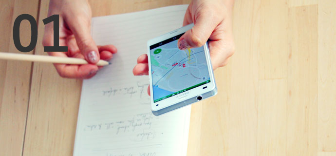
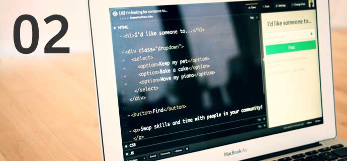
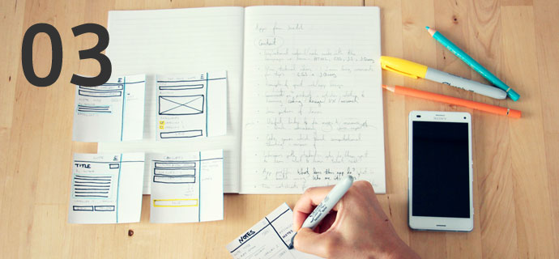
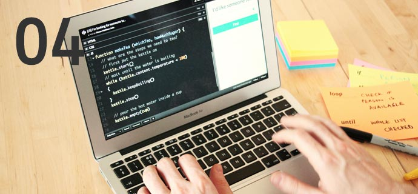
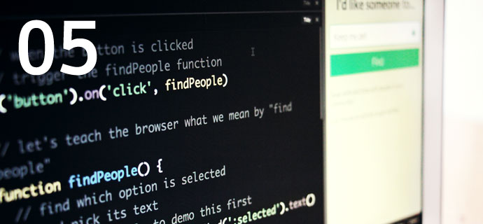
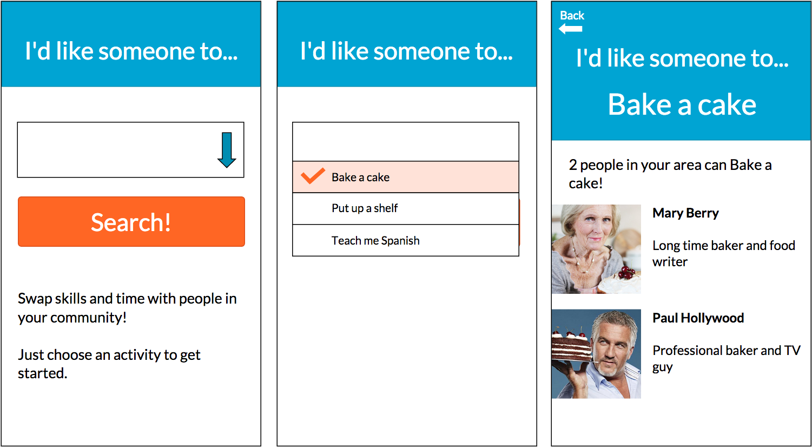

<!--

* !important manage expectations, eg: How long does it take to make an app (show some examples from apps we made, like MeBooks.. and then Pinboard.in)? This course is 3 days.. what can we do with this time?
* 4 blocks of tables for 4 teams (ish)
* smaller group discussions (with post-its and markers) and the "report" to the larger group
* explain prototyping tools like Firebase

-->

# Coding and app-making for beginners

### When is lunch?

Research shows that people focus much better when they know what time they're going to eat...

So, we will have **lunch break** at around 1pm for 1 hour, aiming to wrap up by 4pm.

### Two words about ourselves

- **Yuki**: studied art, started tinkering with code some 10 years ago, now develops software at [The Mill](http://www.themill.com) a post-production, visual effects and animation company. He's designing and building software that makes work easier and more efficient for the team.

- **Matteo** studied graphic design. He also taught himself to code. He built social platforms and educational games for the BBC, Science Museum and now teaches at Ravensbourne.  

- **Aimee** studied fashion design, makes clothes and websites. She is the *jargon buster*, the bridge between beginners and professional coders.

**No computer scientists**, we all learned code by ourselves through experimenting and tinkering. 

We want to show you that it's easy to get started and anyone can give it a go!

### Introduce each other

We want this course to be **informal** and relaxed, so if you have any questions at any time just ask. We're also going to ask you many **questions**!

We'd like you to introduce yourself to your neighbour. Then we'll ask you to introduce each other to the rest of the group.

1. A bit about yourself
* How did you hear about this course?
* Why are you on this course?

<!--* What is your experience with coding so far?-->

You can jot down the answers on post-its and we'll then stick them on the wall...

<!-- make sure we ask questions to the people that are being introduced! -->

<!--

This course is about getting **creative** with **code**.

Getting familiar with how coders work day to day, and experiencing the **design and development process** first-hand. How to take an idea from zero to working prototype. 

For many of you, this will be a **memorable day**. You'll write your **first line of code**, and in a few weeks you'll have made **your own app**, from scratch!

We're going to show you the **basics** and together we'll create an app **template** that you can then customise. The app template will connect to an online database to load data, and manipulate it in response to user inputs. 

Using **HTML**, **CSS** and **JavaScript**!

This is an introductory course, inevitably there are parts of the process that we won't cover (such as how to market your app or package it for a specific market).

It's going to be **challenging** and we want to make sure that you also have **fun**!
 
We're not here to talk at you, but to work with you and we want you to **work together** and help each other.

-->

# Roadmap

When	| What	
---	| ----	
 | On the first day we discuss key concepts around apps (interface, logic, data) and start making with HTML & CSS.
 | We work together to generate, spec out and test your app ideas. Then start programming with JavaScript.
 | You'll apply your research to sketch out how your app looks and behaves on paper. Then you'll make digital wireframes.
 | You'll present your app designs and we'll review them together. Then get into the core concepts of programming.
 | You will use JavaScript _libraries_ to speed up your development and learn how to troubleshoot your code, aka _debugging_.
 | Tweak your app prototype. Celebrate your achievements, and take away free resources to continue your learning journey.

### GitHub

All the course material is here: 
[**github.com/CodeAndCake/AppsFromScratch**](https://github.com/CodeAndCake/AppsFromScratch) 

Including notes from each session, exercises, sample code, presentations and links to learn more!


# What is an app?

Let's sketch a **working definition** of *app*.

How do you explain what an app is to someone or something who's never seen/used one, like an *alien*?


### Your turn

Form small teams (max 4 people).

Pretending one of you is the *alien*, let's ask some obvious questions and jot down some answers and key words on post-its. 

If people answer with jargon, like *software* or *download*, then we ask them to explain those too to your *alien*.

* **Where** do you find apps?
* What does an app **look like**?  
* How do you **interact** with an app? Do you speak to it, do you shake it etc?
* **Who makes** apps?
* What are apps **made out of**?
* **Who uses** apps? Why?
* What are apps useful for? What can you do with apps? How do they **serve** people who use them?
* **How often** do people use apps? 

<!--
* Can you buy apps? Who sells them?
* Would you download an app if you need it only once or twice?
-->
After 10-15 minutes, we'll have a group conversation all together.

### What is an app, then?

There is no clear-cut definition of *app*.

For the sake of this course, we like to think of apps as **small digital tools** that are connected to the Web.

To use an analogy, if a website is like a *book*, which you use to find and consume information, an app is closer to a *whisk*, which you use to make something with.


Apps generally have a specific function, or a small set of functions. They are not trying to do everything.


This is *not* a good app. It is not **usable**, even though all the tools it features could be usable (and possibly useful) on their own.

### **How long** does it take to make an **app**?

This course is 24 hours long, ie **3 working days**.

The point of this course is to *introduce* you to the app-making **process** and **tools**.

* **Thimble**: free online code editor, live preview
* **Firebase**: real-time database, excellent for prototyping
* **HTML**, **CSS** and **JavaScript**: universal languages, entry point to more specialised ones (and useful to know for other jobs!)
* **GitHub repository**: industry-standard collaborative version-control system

This is an introductory course, inevitably there are parts of the process that we won't cover (such as how to market your app or package it for a specific market).

<!-- In 3 days we may not get an app on the App Store, but don't lose heart! -->

In 3 days you will **get started with coding** and by the end you will:

* have a solid foundation to continue learning
* have first-hand experience of the design and development process
* feel confident speaking about your ideas with other designers, coders and product managers

<!--### What apps do you use most? 

And do you know what they have in common? Let us tell you...-->

### Key concepts

1. **Interface**, that is the part(s) of the app you interact with (touch, read, click)
* **Data**
* **Logic**


# Breaking down apps

Form groups of 2-3 people, choose one app that you are all familiar with and analyse it using this framework:

1. What is the main **purpose** of the app?
* **When** do people need this app? Be specific.
* List the *verbs* of the app, ie what **actions** does the app allow you to do. Think about possible verbs that are not part of the app, and why it may be that you're not allowed to perform those actions.
* What **input** does the app require from you?  
* Where does the app's **data** come from? Who creates it?
* What does the app do with that data (ie what's the app **logic**)?
* What **output** does the app produce?

<!-- 10-15 minutes in groups, then 15-20 minutes review, and then it should be lunch break -->


# Your brief

### Make an app that helps people sort through heaps of data to **find who/what they are looking for**.

**The *who/what* is up to you**. People may be looking for other people in their community to do something together, or they may be looking for food recipes, places to go, books to read, films to watch.. 

No matter which data the app uses, its **logic** will be the same:

1. **Load data** from an online database 
* Capture **user inputs**, when they click on buttons, type into text boxes or choose from a dropdown menu etc.
* **Sort data** according to user choices, for instance filtering out data that doesn't match their choices
* Present a human-readable **output** 

### Interface

Here's an initial sketch of how the app may look and work

[](https://app.moqups.com/aimeebethmj@gmail.com/424uOp4p55/view/page/a80b23701)

### Data

We'll show you how to create structured data (aka a **database**). No scary formula or data crunching though. 

Later on you can change the data to make your app serve your own purposes!


# Let's code

Go to [thimble.mozilla.org](https://thimble.mozilla.org) and sign up for the free account.

### HTML

1. `h1` (useful for Google Fonts)
* `p`, a couple of them
* `select` and `option`
* Add a `button` 
* Publish your work so far

### CSS intro

1. Show **selectors** with *quick wins*
	* Hide `p`
	* `h1` centred
* Introduce **Web Inspector**, HTML and CSS tabs.
* `background-image`
	* `background-size: cover;`
	* `background-repeat: no-repeat;` and may have to add `html {height: 100%;}`
* CSS **comments** 
* Typography
	* `font-size`
	* `font-weight`
	* [Google Fonts](https://www.google.com/fonts)
* Style `select` and `button`
	* `border: none;`
	* `border-radius`
	* `margin`
	* `padding`
* Colours
	* Web inspector colour picker (maybe pick a colour from Facebook). Everything is lost on *page refresh* so need to copy-paste into our code.
	* `background`
	* `color`
	* `border-color`
	* Check out [Kuler](https://color.adobe.com) and/or [Flat UI colors](https://flatuicolors.com/) for inspirations

<!--
### Final touches

* Media queries

	```css
	/* if the screen is larger than 600px..  */
	@media (min-width: 600px) {
	  body {
	    max-width: 600px;
	    margin: auto;
	    font-size: 1em;
	  }
	}
	```
* Icons using [FontAwesome](https://fortawesome.github.io/Font-Awesome/)

	```css
	.dropdown
	{
	  position: relative;
	}
	.dropdown:after
	{
	  content: "\f063";
	  font-family: FontAwesome;
	  position: absolute;
	  top: .75em;
	  right: .75em;
	  font-size: 2em;
	  pointer-events: none;
	}
	```

* Make the app look proper on a phone. Google `how to stop phone zooming out pages`

* Make the app **full screen**. Google `how to hide address bar in mobile browser` and you should find [this tutorial](http://www.html5rocks.com/en/mobile/fullscreen/) 

* Add the app to your phone's **home screen**
 
	`<link rel="apple-touch-icon" href="blabla.png">`
	
* Transparency?	
	
* Take inspiration from these fancy demos by Codrops:
	* [Custom select elements](http://tympanus.net/codrops/2014/07/10/inspiration-for-custom-select-elements/)
	* [Minimal form interface](http://tympanus.net/codrops/2014/04/01/minimal-form-interface)
	* [Natural language form](http://tympanus.net/codrops/2013/05/21/natural-language-form-with-custom-input-elements)
-->

### License

[](http://creativecommons.org/licenses/by-nc-sa/4.0)

This work is licensed under a [Creative Commons Attribution-NonCommercial-ShareAlike 4.0 International License ](http://creativecommons.org/licenses/by-nc-sa/4.0)