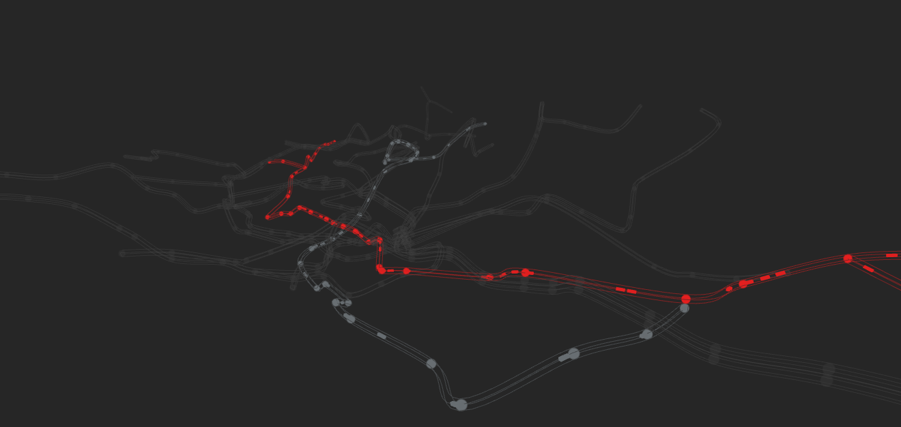
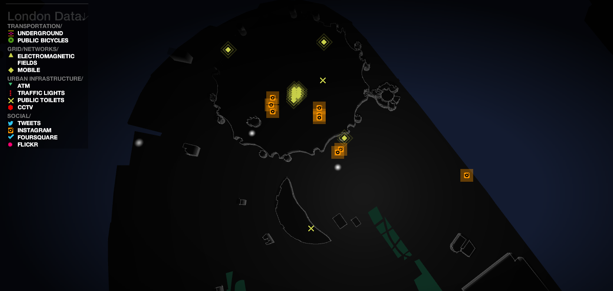

### Plan

AM:
 
- [ ] 0.5 hour

	[Quiz time](https://github.com/RavensbourneWebMedia/Web-development-workshop/tree/2016/sessions/04#quiz-time) with Team A and Team 1

- [ ] 1 hour
	
	Move `script` elements to the end of the `body`
	
	Breakpoint tool
	
	Displaying data (we started last week but it didn't work so let's do that again properly) how to create a string of HTML out of a data object and append it in your HTML

PM:

- [ ] 1 hour

	Filter data
	
	Integrate pre-written functions with an emphasis on what to customise

- [ ] 0.5 hour

	Fun, lightweight activity: CSS / start creating your own database

<!--
http://www.unheap.com

[jQuery challenge by Codecademy](https://www.codecademy.com/learn/jquery)

Yuki:

- [ ] take [sorting and filtering functions from demo-app](https://github.com/CodeAndCake/AppsFromScratch/blob/v3/demo-app) and create versions of those functions that work with [Firebase API queries](https://www.firebase.com/docs/web/api/query/)
-->

# Coding and app-making for beginners 

## Day 5

[Last week](../04) you tinkered with HTML & CSS and learned how to *upload* new data to Firebase via the JS Console.

Now that our database is ripe with data, we can **filter** that data in response to user **inputs** and display it in the app **interface**.

**Today** we're going to start with a [quiz](#quiz-time) to recap HTML, CSS and JS. 

Then you'll dive into JS, getting hands-on with **jQuery**. We will give you some pre-written code to copy-paste and integrate into your apps.

Today is about mastering **the art of copy-paste**. To become a good coder you don't need to "speak" JavaScript (or whatever other programming language). Instead, you should learn how to:

1. **Search** for solutions online 
* **Skim** through results
* **Copy-paste** relevant results into your code
* **Adapt** the pasted code to your app (changing *variable* names, tweaking *functions* etc).

When writing code, it's important to let go of any fear of making **mistakes**. Embrace mistakes, take them as an opportunity to learn. When something unexpected happens, try to avoid thinking `What have I done wrong?`. Instead ask yourself `Why did the computer not behave as I expected?`. Come up with a possible answer and then test it.

We will show you some tools and tricks to make the process of spotting mistakes and testing solutions (aka **debugging**) very efficient.

<!--
1. [Inspirations](#inspirations): cool stuff built with JS
* [JS challenge](#challenge)
* [Prototype](#prototyping) one component of your app

# Inspirations

Some cool stuff built with JS (100% Web technologies)!

[Emotion detection  
	](http://auduno.github.io/clmtrackr/examples/clm_emotiondetection.html)

[Audio (from mic) visualiser
](http://googlechrome.github.io/web-audio-samples/samples/audio/visualizer-live.html)

[3D London Tube map    
	](http://brunoimbrizi.com/experiments/#/07)

[Cyber-attacks map  
	](http://map.norsecorp.com/)

[Social media activity map  
	](http://wearedata.watchdogs.com/start.php?locale=en-EN&city=london)

# Challenge!

1. [Fork this pen](http://codepen.io/baddeo/full/JYpgwL)!
* Add an `option` to the dropdown. 
 
	You may have to add new data to the *spreadsheet* (aka the database).   
* Code the app's behaviour in response to the new option.

	There are 3 functions you will need to hack:
	
	* `getPeopleList`
	* `getFilteredList`
	* `getSortedList`

# Prototyping

-->

<!--- [ ] Aimee can help with HTML and CSS-->

<!--

1. [Questions](#questions) about computers, people and the **interfaces** in between
* [Wireframing](#wireframing) (*user* interfaces)
* [Prototyping with code](#prototyping-with-code) (*programming* interfaces)

# Session 5

Key questions: 

* What is your app *value*? 
* How do you *communicate* it?

### AM

* [Designing behaviours](#designing-behaviours)
* [Telling the user story](#telling-the-user-story)
* [Wireframing](#wireframing) and [prototyping](#prototyping)

### PM

* [Presentations](#presentations)

# Designing behaviours

Not just interfaces.

We deal with interfaces, tools and devices, but what we design, ultimately, are **human behaviours**. 

We design means to **enforce**, **prevent** or **facilitate** behaviours.

### Persuasive interfaces

### Engaging interfaces

Also, check out animated examples of design patterns at [UseYourInterface](http://useyourinterface.com)

# Telling the user story

Don't present *features*. Tell a *story*.

1. **WHO** 

	* Think about a realistic *protagonist*
	* Give her a name
 	* Make her relatable
2. **WHERE** and **WHEN** 

	Think about a scenario
3. **HOW** 

	What are the *feelings* of your protagonist?
4. **WHAT** 

	* What *actions* does she take? 
	* What are their *results*?

# Wireframing

See last session's [notes on wireframing](../04/README.md#wireframes)

Think about the **3-4 key pages** that communicate what's unique about your app and how it benefits who uses it

Use [Moqups](https://moqups.com) or [Divshot](https://architect.divshot.com) to create your wireframes

# Prototyping

We'll show you hot to use [Invision](http://invisionapp.com), to link your wireframes and set them in motion.

Your prototypes will communicate how your app works, and offer a springboard for conversations with developers, designers, collaborators, investors...

-->

### License

This work is licensed under a [Creative Commons Attribution-NonCommercial-ShareAlike 4.0 International License ](http://creativecommons.org/licenses/by-nc-sa/4.0)

